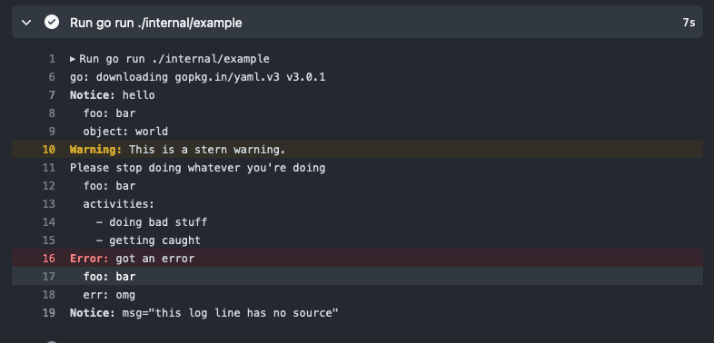

# actionslog

[](https://pkg.go.dev/github.com/willabides/actionslog)

[Contributions welcome](./CONTRIBUTING.md).

```shell
go get github.com/willabides/actionslog
```

actionslog's creation was [blogged here](https://willabides.com/posts/go-slog-handler-part-1/)

actionslog provides a wrapper around a Handler for Go's [log/slog](https://pkg.go.dev/log/slog) that outputs logs
as [GitHub Actions workflow commands](https://docs.github.com/en/actions/using-workflows/workflow-commands-for-github-actions#setting-a-debug-message)
that will cause the logs to show up in the GitHub UI -- optionally with links to the source code.

It can wrap any slog.Handler, but it also provides human.Handler which is meant to be a little easier for human's to
read. human.Handler's output is roughly `<message>\n  <vars as yaml>`, so output
for `logger.Info("hello", slog.String("object", "world"), slog.Any("list", []string{"a", "b", "c"))` would look like:

```text
hello
  object: world
  list:
    - a
    - b
    - c
```

actionslog.Wrapper implements [slog.Handler](https://pkg.go.dev/log/slog#Handler) from "log/slog" when built with go
1.21 or higher. When built with go earlier versions that predate "log/slog", it
implements [slog.Handler](https://pkg.go.dev/golang.org/x/exp/slog#Handler) from "golang.org/x/exp/slog".

## Usage

```go
package main

import (
	"log/slog"

	"github.com/willabides/actionslog"
	"github.com/willabides/actionslog/human"
)

func main() {
	logger := slog.New(&actionslog.Wrapper{
		Handler: human.WithOutput,
	})
	logger.Info("hello", slog.String("object", "world"))
}
```

## Screenshots

This is what the output of ./internal/example looks like in the GitHub UI.

### Run Log



### Workflow Summary


### Inline Code Annotations


