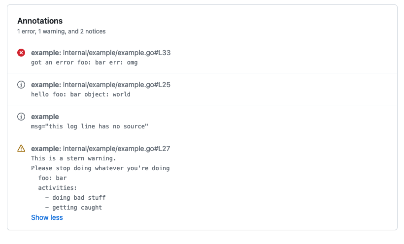

# actionslog

[](https://pkg.go.dev/github.com/willabides/actionslog)

[Contributions welcome](./CONTRIBUTING.md).

```shell
go get github.com/willabides/actionslog
```

actionslog provides a wrapper around a Handler for Go's [log/slog](https://pkg.go.dev/log/slog) that outputs logs
as [GitHub Actions workflow commands](https://docs.github.com/en/actions/using-workflows/workflow-commands-for-github-actions#setting-a-debug-message)
that will cause the logs to show up in the GitHub UI -- optionally with links to the source code.

It can wrap any slog.Handler, but it also provides a default Handler that formats the logs in a way that I think is easy
to read in the GitHub UI.

The default output format is roughly `<message>\n<vars as yaml>` after GitHub is done with it. So, in your output,
`logger.Info("hello", slog.String("object", "world"), slog.Any("list", []string{"a", "b", "c"))` would look like:

```
hello
object: world
list:
  - a
  - b  
```

actionslog.Handler implements [slog.Handler](https://pkg.go.dev/log/slog#Handler) from "log/slog" when built with go
1.21 or higher. When built with go earlier versions that predate "log/slog", it
implements [slog.Handler](https://pkg.go.dev/golang.org/x/exp/slog#Handler) from "golang.org/x/exp/slog".

## Usage

```go
package main

import (
	"log/slog"
	"os"

	"github.com/willabides/actionslog"
)

func main() {
	logger := slog.New(actionslog.New(
		os.Stdout,
		&actionslog.Options{
			AddSource: true,
			Level:     slog.LevelDebug,
		},
	))

	logger.Info("hello", slog.String("object", "world"))
}
```

## Screenshots

This is what the output of ./internal/example looks like in the GitHub UI.

### Run Log


### Workflow Summary



### Inline Code Annotations


